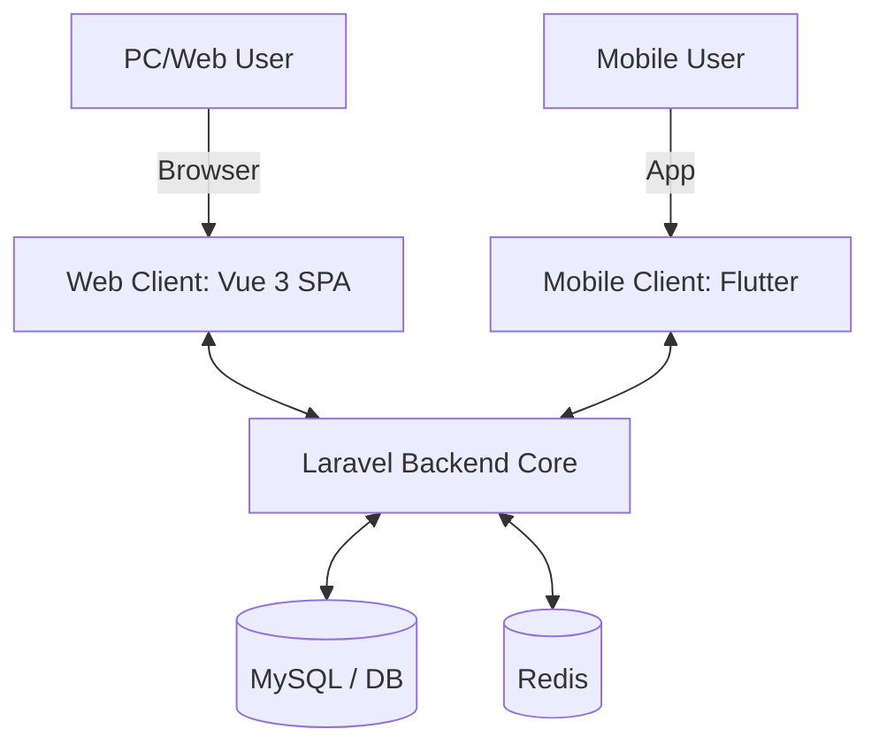

# System Architecture

## 1. Overview
The system adopts a multi-client architecture powered by a centralized Laravel backend.



- **PC/Web Client:** Vue 3 SPA architecture with Vue Router for client-side routing. The frontend is built as a standalone Single Page Application served by Laravel via Vite, providing seamless page transitions and rich interactive experiences.

## 2. Frontend Architecture (Vue 3 SPA)

The frontend is built as a Vue 3 Single Page Application with the following structure:

- **Pages (`resources/js/Pages/`):**
  - `Home.vue` - 首页，展示精选文章和系统介绍
  - `Blog.vue` - 博客列表，支持分类筛选和分页
  - `Author.vue` - 作者页面，展示个人信息和 GitHub 贡献热力图
  - `Posts/Index.vue` - 文章列表页
  - `Posts/Show.vue` - 文章详情页

- **Components (`resources/js/Components/`):**
  - `SidebarMenu.vue` - 全局侧边栏导航菜单
  - `Footer.vue` - 页脚组件，支持显示/隐藏切换
  - `SearchOverlay.vue` - 全局搜索覆盖层
  - `SettingsPanel.vue` - 语言和主题设置面板
  - `SplashScreen.vue` - 应用启动画面
  - `ErrorPage.vue` - 错误页面组件

- **Global Features:**
  - **Vue Router**: 客户端路由管理，支持 SPA 页面切换
  - **Vue I18n**: 多语言支持（中文/英文）
  - **Theme System**: 主题色切换系统（RED/ORANGE/BLUE/GREEN/PINK）
  - **Motion**: 基于 @vueuse/motion 的动画效果

- **Layout Pattern:**
  ```
  <div class="min-h-screen">
    <SidebarMenu />           <!-- 固定左侧导航 (64px) -->
    <div class="ml-16">       <!-- 主内容区域 -->
      <!-- Page Content -->
      <Footer />
    </div>
  </div>
  ```

## 3. Routing
- **Public Area (`/`):** Handled by Vue Router client-side routing. Pages are defined in `resources/js/Pages/` and rendered as Vue components.
- **Admin Area (`/admin/*`):** Handled by Laravel web controllers with Blade templates. Isolated under `auth` middleware. Uses independent controllers.
- **API Endpoints (`/api/v1/*`):** RESTful endpoints for external clients (Flutter mobile app). Returns structured JSON via Http Resources.

## 4. Core Technologies & Stack
- **Backend Framework:** Laravel 11 (PHP 8.2+)
- **Web Frontend:** Vue 3 SPA + Vue Router + Vue I18n + TailwindCSS
- **Mobile App:** Flutter (Dart)
- **Database:** MySQL 8.0+ / PostgreSQL 15+
- **Cache & Queue Driver:** Redis
- **Authentication:** Laravel Sanctum
  - *Web (Vue 3 SPA):* Session-based authentication via Sanctum SPA configuration.
  - *Mobile (Flutter):* Token-based authentication via Sanctum API tokens.

## 5. Directory & Routing Architecture
To support both the integrated web frontend and the external mobile app, the backend logic must be carefully segmented:

- `routes/web.php`: Routes for the PC Web Client. Returns the main SPA entry point for Vue Router to handle client-side routing.
- `routes/api.php`: RESTful endpoints for the Flutter application. Controllers here return structured JSON (`Http/Resources`).
- `app/Http/Controllers/Web`: Controllers managing web views and web-specific logic.
- `app/Http/Controllers/Api/V1`: Controllers exclusively handling formatting and routing for Flutter API requests.
- `app/Services`: **Crucial shared layer**. Both Web and API controllers inject these services to perform the actual business logic, ensuring DRY (Don't Repeat Yourself) principles.
- `app/Repositories`: **Data access layer**. Encapsulates complex database queries. Simple CRUD operations use Model directly in Service, while complex queries are delegated to Repository classes (Lightweight Repository pattern).
- `resources/js/Pages/`: Vue 3 page components, each representing a route in the SPA.
- `resources/js/Components/`: Reusable Vue components (SidebarMenu, Footer, SearchOverlay, etc.).

## 6. Development Strategy
- **Web Integration:** Vue 3 SPA served via Laravel's Vite configuration. Vue Router handles client-side routing and page transitions.
- **Mobile Integration:** Flutter acts as a separate codebase consuming JSON endpoints from `routes/api.php` over HTTP/HTTPS.
- **Shared Logic:** All business logic resides in Services. Neither controllers should contain direct Eloquent queries unless trivial.

## 7. Observability & Debugging
- **Laravel Telescope:** Used locally for deep debugging of both Web and API requests.
- **Vue DevTools:** Browser extension for debugging Vue 3 component state, props, and routing.
- **Sentry / Bugsnag:** Integrated into production. Errors from Laravel, Vue, and Flutter should all be aggregated here for full-stack visibility.
