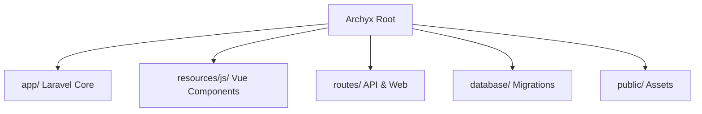

# Archyx Blog System / Archyx 博客系统 🏛️✨

<p align="center">
  
  
  
  
  
</p>

---

### 🌟 项目愿景 | Vision

> **Archyx** 旨在构建一个面向开发者、极致极简且由 AI 驱动的现代化内容创作与分发系统。
> **Archyx** aims to build a modern content creation and distribution system designed for developers, featuring extreme minimalism and AI-driven evolution.


*示意图：极简主义与现代技术的融合 | Minimalist fusion of modern technology*

---

⚠️ **法律声明 | Legal Notice**

> **本项目采用严格的非商业个人学习许可证。**
> **This project is licensed under a strict Personal Non-Commercial Learning License.**

<details>
<summary>点击展开详细声明 | Click to expand details</summary>

- 仅限个人学习和非商业用途。
- 严禁任何商业化、企业、组织、机构、盈利性或成品代码使用。
- 个人用户必须注明作者 GitHub 地址：“Powered by [adlerdler](https://github.com/adlerdler)”。
- For personal learning and non-commercial use only.
- Commercial/Enterprise use is strictly prohibited.
- Attribution required: “Powered by [adlerdler](https://github.com/adlerdler)”.
</details>

---

## ✨ 功能特性 | Features

| 特性 | 描述 | Description |
| :--- | :--- | :--- |
| 🎨 **Constructivist UI** | 基于构成主义美学的激进界面。 | Radical interface based on Constructivist aesthetics. |
| ✍️ **Markdown Native** | 原生 Markdown 支持，实时预览。 | Native Markdown support with live preview. |
| 🤖 **AI-First Workflow** | 深度集成 Trae/Claude，支持 Agentic 开发。 | Deep Trae/Claude integration for Agentic development. |
| 📱 **SPA Architecture** | Vue 3 + Vue Router 单页应用架构。 | Vue 3 + Vue Router Single Page Application architecture. |
| 🌍 **i18n Support** | 多语言国际化支持。 | Multi-language internationalization support. |
| 🔒 **Modern Auth** | 安全可靠的 Laravel 11 认证系统。 | Secure Laravel 11 authentication system. |

---

## 🛠 技术栈 | Tech Stack

### Backend (Laravel 11)
- **Extreme Minimalism**: 移除冗余提供者与配置。
- **Eloquent ORM**: 优雅的数据处理。
- **SQLite/MySQL**: 灵活的持久化选择。

### Frontend (Vue 3 SPA)
- **Vue Router**: 客户端路由管理。
- **Vue I18n**: 多语言国际化。
- **Vite**: 极速构建体验。
- **Tailwind CSS**: 实用优先的样式定义。
- **Lucide Icons**: 现代化图标库。
- **@vueuse/motion**: 动画与过渡效果。

---

## 📁 目录结构 | Directory Structure



---

## 🚀 快速开始 | Quick Start

### 1. 环境准备 | Prerequisites
- PHP 8.2+
- Node.js 18+
- Composer

### 2. 核心步骤 | Core Steps

```bash
# 克隆并进入目录
git clone <your-repo-url> && cd laravel-vue-app

# 安装前后端依赖
composer install && npm install

# 配置环境
cp .env.example .env && php artisan key:generate

# 数据库迁移与初始化
php artisan migrate --seed

# 启动引擎
php artisan serve & npm run dev
```

---

## 📄 开发规范 | Development Guidelines

本项目遵循 **Extreme Minimalism** 哲学：
1. **函数原子化**: 保持逻辑单一。
2. **代码即文档**: 优先编写自解释代码。
3. **AI 协同**: 每次重大变更需更新 `evolution.md`。

---

## 📝 演进历程 | Evolution

查看 [evolution.md](file:///i:/Code%20editing/bolg_laravel_adlerian/laravel-vue-app/evolution.md) 了解 AI 导师与人类导师如何共同塑造 Archyx。

---

<p align="center">
  Built with ❤️ by AI and <a href="https://github.com/adlerdler">adlerdler</a>
</p>
