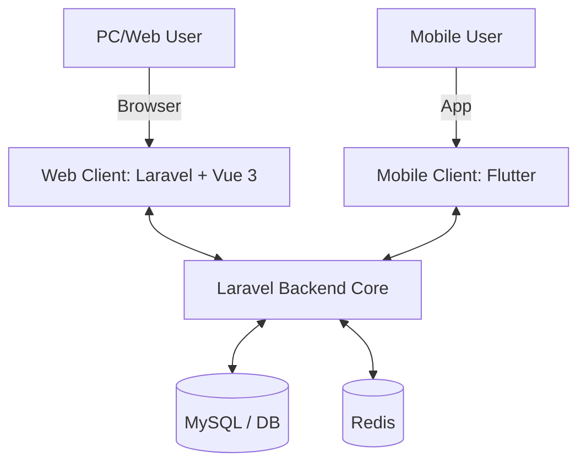

# System Architecture

## 1. Overview
The system adopts a multi-client architecture powered by a centralized Laravel backend.

- **PC/Web Client:** Laravel + Vue 3 Hybrid architecture. The frontend is primarily served via Laravel Blade templates for SEO and performance. Vue 3 is used for **Selective Hydration** on specific interactive elements.

## 2. Vue 3 Usage Boundaries
To maintain a lean and SEO-optimized frontend, we strictly define where Vue 3 is used:

- **Server-Side Rendered (Blade Only):**
  - Homepage & Article Lists
  - Post Detail Content
  - Category & Tag Landing Pages
- **Client-Side Enhanced (Vue Components):**
  - **Editor:** Vditor integration for Markdown editing.
  - **Interactions:** Comment sections, Like/Bookmark buttons.
  - **Utilities:** Image uploaders, real-time search bars.
- **Admin Forms (Blade):**
  - Simple CRUD forms for Tags and Categories management.

## 3. Routing
- **Public Area (`/`):** Handled by web controllers returning Blade views. No authentication required.
- **Admin Area (`/admin/*`):** Isolated under `auth` middleware. Uses independent controllers.

## 3. Core Technologies & Stack
- **Backend Framework:** Laravel 11 (PHP 8.2+)
- **Web Frontend:** Vue 3 (Hybrid Mode: Blade + Vue) + TailwindCSS
- **Mobile App:** Flutter (Dart)
- **Database:** MySQL 8.0+ / PostgreSQL 15+
- **Cache & Queue Driver:** Redis
- **Authentication:** Laravel Sanctum
  - *Web (Vue 3):* Session-based authentication via Sanctum SPA configuration.
  - *Mobile (Flutter):* Token-based authentication via Sanctum API tokens.

## 4. Directory & Routing Architecture
To support both the integrated web frontend and the external mobile app, the backend logic must be carefully segmented:

- `routes/web.php`: Routes for the PC Web Client. Controllers here return Vue components (via `Inertia::render` or Blade + Vue).
- `routes/api.php`: RESTful endpoints for the Flutter application. Controllers here return structured JSON (`Http/Resources`).
- `app/Http/Controllers/Web`: Controllers managing web views and web-specific logic.
- `app/Http/Controllers/Api/V1`: Controllers exclusively handling formatting and routing for Flutter API requests.
- `app/Services`: **Crucial shared layer**. Both Web and API controllers inject these services to perform the actual business logic, ensuring DRY (Don't Repeat Yourself) principles.

## 5. Development Strategy
- **Web Integration:** Routing is handled by Laravel's `web.php`. Data is passed directly from controllers to Vue component props via Inertia.
- **Mobile Integration:** Flutter acts as a separate codebase consuming JSON endpoints from `routes/api.php` over HTTP/HTTPS.
- **Shared Logic:** All business logic resides in Services. Neither controllers should contain direct Eloquent queries unless trivial.

## 6. Observability & Debugging
- **Laravel Telescope:** Used locally for deep debugging of both Web and API requests.
- **Sentry / Bugsnag:** Integrated into production. Errors from Laravel, Vue, and Flutter should all be aggregated here for full-stack visibility.
